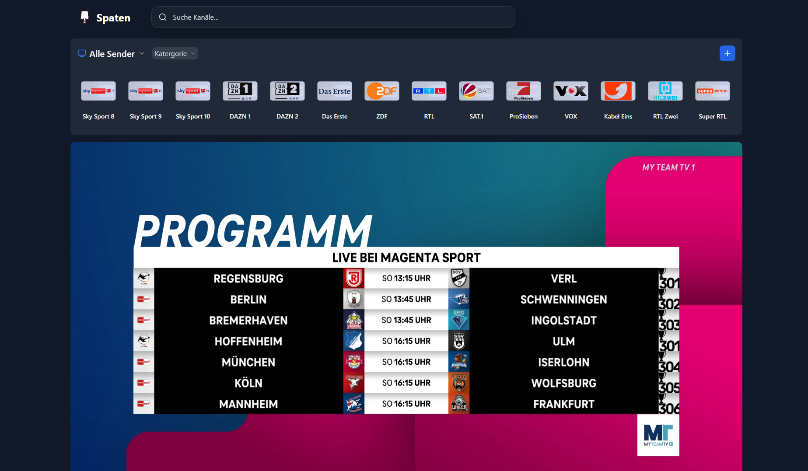

# 📺 IPTV Spaten (in development)

> ⚠️ **Note:**  
> This project is still under **active development**.  
> Expect missing features, bugs, or changes at any time.  
> Use with caution and feel free to share feedback or ideas!

---

## 📖 About

**IPTV Spaten** is a lightweight application for:

- 🎬 **IPTV Restreaming** – re-routing streams for better compatibility  
- 👥 **Synchronization (Watch2Gether)** – enjoy IPTV with friends in real time  
- 🌐 **Web Frontend** – easy-to-use browser interface  

Currently, this is an **early-stage version** mainly built for the **German user base**.  
However, the documentation is in **English** to make it easy for international contributors to join.

---

## 🚀 Getting Started

### ▶️ Run with Docker (Recommended)

Clone the repository:

```bash
git clone https://github.com/TillitschScHocK/IPTV-Restream
````

Make sure **Docker** is running and start the service with:

```bash
docker compose up -d
```

Then open:

* [http://localhost:1966](http://localhost:1966)
  or
* [http://YOUR-IP:1966](http://YOUR-IP:1966)

> [!IMPORTANT]
> If a channel or playlist does not work, try switching to `proxy` or `restream` mode.
> These modes solve most playback issues. See [Channel Mode](#channel-mode) for details.

---

## ⚙️ Settings

### Channel Mode

You can choose between **three playback modes** depending on your needs:

#### 🔹 `Direct`

* Uses the source stream directly
* ⚠️ Not reliable due to **CORS**, **IP/device restrictions**, and lack of support for custom headers
* Not recommended except for testing

#### 🔹 `Proxy` (**Preferred**)

* Streams are proxied through the backend
* ✅ Works with custom headers and bypasses CORS issues
* Best choice for most users

#### 🔹 `Restream`

* The backend **caches and restreams** the source with **FFmpeg**
* Useful for provider restrictions or sync issues
* ⏳ May cause slightly longer load times

---

## 📱 Preview

### 💻 Browser Application


### 📲 Mobile Application


---

## ❓ FAQ & Common Issues

### 👉 Which streaming mode should I use?

> Start with **Direct** → if it fails, switch to **Proxy** → if it still fails, try **Restream**.

### 👉 Can I use channels in another IPTV player?

> Yes!
> Simply click the 📺 **TV button** in the frontend to generate a playlist link.
> You can then use this link in **any IPTV player**.

---

## 🙏 Acknowledgements

A **huge thank you** to the original project:
[📦 IPTV-Restream by antebrl](https://github.com/antebrl/IPTV-Restream)

---
